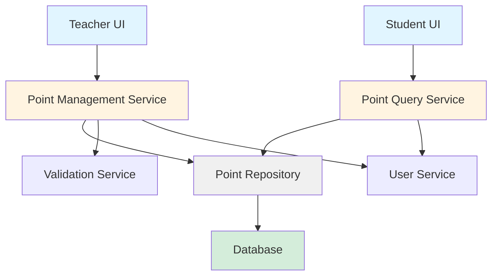
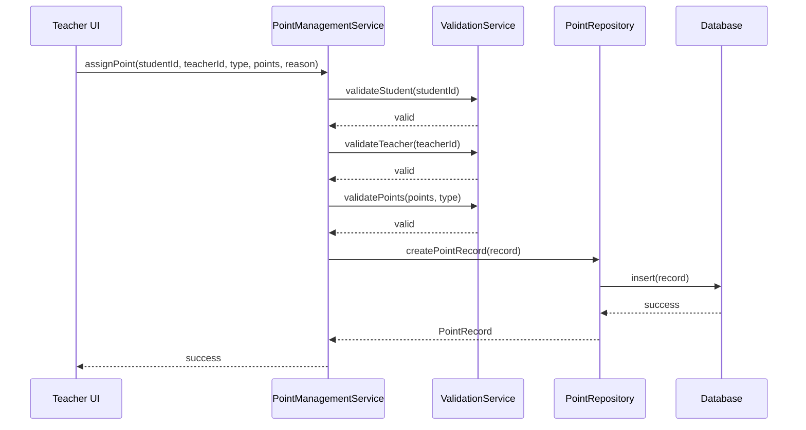
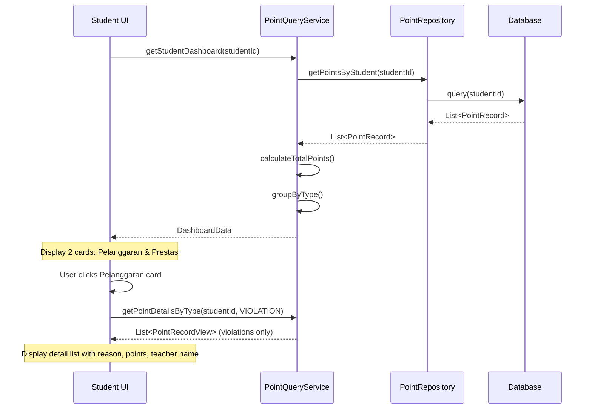
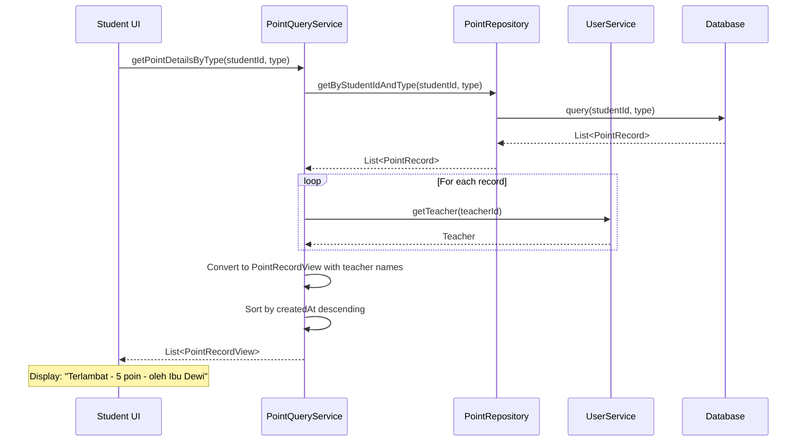
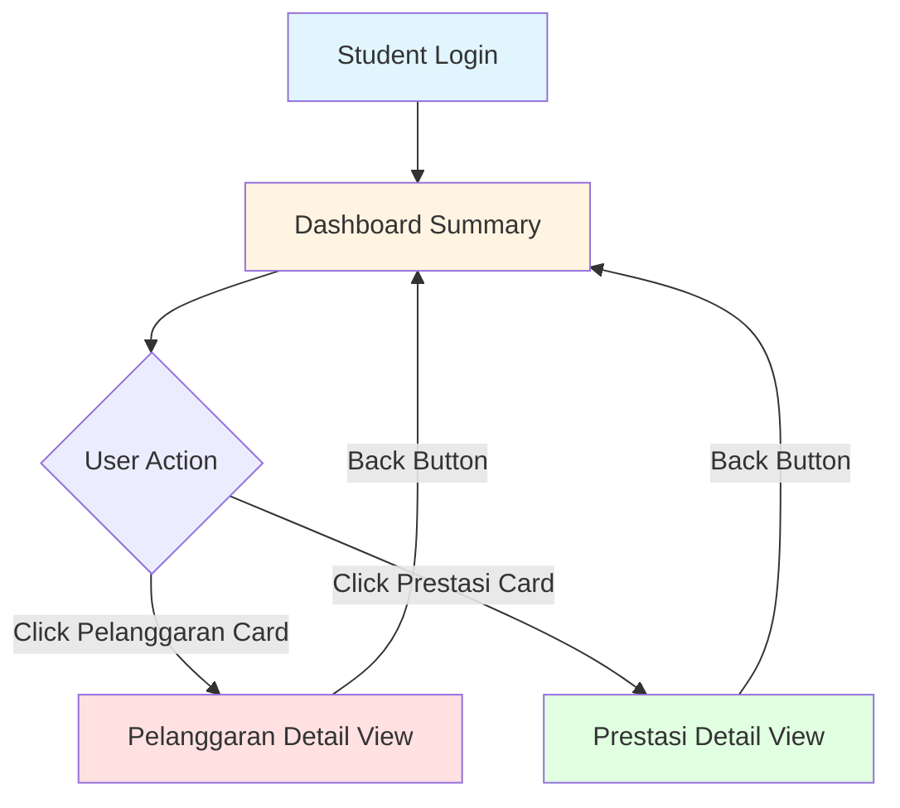

# Design Document: Student Point System

## Overview

Sistem Poin Siswa adalah aplikasi yang memungkinkan guru untuk memberikan poin kepada siswa berdasarkan pelanggaran atau prestasi yang dilakukan. Sistem ini menyediakan mekanisme pencatatan yang transparan dimana setiap pemberian poin dicatat dengan informasi lengkap termasuk guru yang memberikan, jenis aktivitas (pelanggaran/prestasi), dan jumlah poin. Siswa dapat melihat riwayat poin mereka melalui dashboard yang menampilkan detail setiap transaksi poin.

Aplikasi ini dibangun dengan Flutter/Dart untuk mendukung deployment multi-platform (mobile dan web). Arsitektur menggunakan pola layering dengan pemisahan yang jelas antara presentation layer, business logic layer, dan data layer untuk memastikan maintainability dan testability.

## Architecture



## Main Algorithm/Workflow

### Teacher Assigns Points Flow



### Student Views Dashboard Flow



### Student Views Point Details Flow



## Components and Interfaces

### Component 1: PointManagementService

**Purpose**: Mengelola logika bisnis untuk pemberian poin oleh guru

**Interface**:
```dart
abstract class PointManagementService {
  /// Memberikan poin kepada siswa
  /// 
  /// Preconditions:
  /// - studentId harus valid dan terdaftar
  /// - teacherId harus valid dan memiliki role guru
  /// - points harus > 0
  /// - type harus 'violation' atau 'achievement'
  /// 
  /// Postconditions:
  /// - PointRecord baru dibuat di database
  /// - totalPoints siswa terupdate
  Future<Result<PointRecord>> assignPoint({
    required String studentId,
    required String teacherId,
    required PointType type,
    required int points,
    required String reason,
  });
  
  /// Mendapatkan riwayat pemberian poin oleh guru tertentu
  Future<List<PointRecord>> getPointsByTeacher(String teacherId);
  
  /// Membatalkan pemberian poin (jika diperlukan)
  Future<Result<void>> revokePoint(String pointRecordId);
}
```

**Responsibilities**:
- Validasi input sebelum menyimpan data
- Koordinasi dengan ValidationService untuk memastikan data valid
- Mengelola transaksi pemberian poin
- Logging aktivitas guru

### Component 2: PointQueryService

**Purpose**: Menyediakan query untuk menampilkan data poin siswa

**Interface**:
```dart
abstract class PointQueryService {
  /// Mendapatkan dashboard siswa dengan total poin dan riwayat
  /// 
  /// Preconditions:
  /// - studentId harus valid
  /// 
  /// Postconditions:
  /// - Mengembalikan DashboardData dengan total poin dan list records
  /// - Data diurutkan berdasarkan tanggal terbaru
  Future<DashboardData> getStudentDashboard(String studentId);
  
  /// Mendapatkan detail poin berdasarkan tipe (untuk detail view)
  /// 
  /// Preconditions:
  /// - studentId harus valid
  /// - type harus VIOLATION atau ACHIEVEMENT
  /// 
  /// Postconditions:
  /// - Mengembalikan list PointRecordView yang sudah di-filter by type
  /// - Data diurutkan berdasarkan tanggal terbaru
  /// - Teacher names sudah di-resolve
  Future<List<PointRecordView>> getPointDetailsByType(
    String studentId, 
    PointType type
  );
  
  /// Mendapatkan semua point records untuk siswa tertentu
  Future<List<PointRecord>> getPointsByStudent(String studentId);
  
  /// Mendapatkan statistik poin siswa
  Future<PointStatistics> getStudentStatistics(String studentId);
}
```

**Responsibilities**:
- Query data poin dari repository
- Agregasi dan kalkulasi total poin
- Filtering data berdasarkan tipe (pelanggaran/prestasi)
- Formatting data untuk tampilan dashboard dan detail view
- Caching untuk performa

### Component 3: PointRepository

**Purpose**: Abstraksi akses data untuk point records

**Interface**:
```dart
abstract class PointRepository {
  /// Menyimpan point record baru
  Future<PointRecord> createPointRecord(PointRecord record);
  
  /// Mendapatkan point records berdasarkan studentId
  Future<List<PointRecord>> getByStudentId(String studentId);
  
  /// Mendapatkan point records berdasarkan studentId dan type
  /// 
  /// Preconditions:
  /// - studentId harus valid
  /// - type harus VIOLATION atau ACHIEVEMENT
  /// 
  /// Postconditions:
  /// - Returns list of records filtered by studentId and type
  /// - Only active records included
  Future<List<PointRecord>> getByStudentIdAndType(
    String studentId, 
    PointType type
  );
  
  /// Mendapatkan point records berdasarkan teacherId
  Future<List<PointRecord>> getByTeacherId(String teacherId);
  
  /// Mendapatkan point record berdasarkan ID
  Future<PointRecord?> getById(String id);
  
  /// Update point record
  Future<PointRecord> update(PointRecord record);
  
  /// Delete point record
  Future<void> delete(String id);
}
```

**Responsibilities**:
- CRUD operations untuk PointRecord
- Filtering operations berdasarkan studentId dan type
- Konversi antara domain model dan database model
- Error handling untuk database operations

### Component 4: ValidationService

**Purpose**: Validasi data sebelum operasi bisnis

**Interface**:
```dart
abstract class ValidationService {
  /// Validasi apakah student ID valid
  Future<bool> validateStudent(String studentId);
  
  /// Validasi apakah teacher ID valid dan memiliki role guru
  Future<bool> validateTeacher(String teacherId);
  
  /// Validasi nilai poin sesuai dengan tipe
  bool validatePoints(int points, PointType type);
  
  /// Validasi reason tidak kosong
  bool validateReason(String reason);
}
```

**Responsibilities**:
- Validasi business rules
- Validasi referential integrity
- Validasi format dan range data

## Data Models

### Model 1: PointRecord

```dart
class PointRecord {
  final String id;
  final String studentId;
  final String teacherId;
  final PointType type;
  final int points;
  final String reason;
  final DateTime createdAt;
  final PointStatus status;
  
  PointRecord({
    required this.id,
    required this.studentId,
    required this.teacherId,
    required this.type,
    required this.points,
    required this.reason,
    required this.createdAt,
    this.status = PointStatus.active,
  });
}

enum PointType {
  violation,    // Pelanggaran (poin negatif)
  achievement,  // Prestasi (poin positif)
}

enum PointStatus {
  active,
  revoked,
}
```

**Validation Rules**:
- `id` harus unique (UUID)
- `studentId` harus mereferensi student yang valid
- `teacherId` harus mereferensi teacher yang valid
- `points` harus > 0 (tipe menentukan positif/negatif)
- `reason` tidak boleh kosong, minimal 5 karakter
- `createdAt` tidak boleh di masa depan
- `type` harus salah satu dari enum PointType

### Model 2: DashboardData

```dart
class DashboardData {
  final String studentId;
  final String studentName;
  final int totalPoints;
  final int violationPoints;
  final int achievementPoints;
  final List<PointRecordView> recentRecords;
  final DateTime lastUpdated;
  
  DashboardData({
    required this.studentId,
    required this.studentName,
    required this.totalPoints,
    required this.violationPoints,
    required this.achievementPoints,
    required this.recentRecords,
    required this.lastUpdated,
  });
}
```

**Validation Rules**:
- `totalPoints` = `achievementPoints` - `violationPoints`
- `violationPoints` >= 0
- `achievementPoints` >= 0
- `recentRecords` diurutkan berdasarkan `createdAt` descending

### Model 3: PointRecordView

```dart
class PointRecordView {
  final String id;
  final String teacherName;
  final PointType type;
  final int points;
  final String reason;
  final DateTime createdAt;
  
  PointRecordView({
    required this.id,
    required this.teacherName,
    required this.type,
    required this.points,
    required this.reason,
    required this.createdAt,
  });
}
```

**Validation Rules**:
- Semua field required
- `teacherName` sudah di-resolve dari `teacherId`
- `points` ditampilkan dengan tanda sesuai `type`

### Model 4: PointStatistics

```dart
class PointStatistics {
  final int totalViolations;
  final int totalAchievements;
  final int netPoints;
  final Map<String, int> violationsByCategory;
  final Map<String, int> achievementsByCategory;
  final List<MonthlyPointSummary> monthlyTrend;
  
  PointStatistics({
    required this.totalViolations,
    required this.totalAchievements,
    required this.netPoints,
    required this.violationsByCategory,
    required this.achievementsByCategory,
    required this.monthlyTrend,
  });
}
```

## UI/UX Flow

### Student Dashboard UI Structure

**Screen 1: Dashboard Summary (Initial View)**

```
┌─────────────────────────────────────┐
│  Dashboard Siswa - [Nama Siswa]    │
├─────────────────────────────────────┤
│                                     │
│  ┌───────────────┐ ┌──────────────┐│
│  │ 🔴 Pelanggaran│ │ 🟢 Prestasi  ││
│  │               │ │              ││
│  │   15 POIN     │ │   20 POIN    ││
│  │               │ │              ││
│  │  [Tap to view]│ │ [Tap to view]││
│  └───────────────┘ └──────────────┘│
│                                     │
│  Net Points: +5                     │
└─────────────────────────────────────┘
```

**Screen 2: Pelanggaran Detail View (After clicking Pelanggaran card)**

```
┌─────────────────────────────────────┐
│  ← Detail Pelanggaran               │
├─────────────────────────────────────┤
│  Total: 15 POIN                     │
├─────────────────────────────────────┤
│                                     │
│  ┌─────────────────────────────────┐│
│  │ Terlambat                       ││
│  │ 5 poin                          ││
│  │ oleh Ibu Dewi                   ││
│  │ 24 Mei 2026, 08:15              ││
│  └─────────────────────────────────┘│
│                                     │
│  ┌─────────────────────────────────┐│
│  │ Tidak mengerjakan PR            ││
│  │ 10 poin                         ││
│  │ oleh Pak Budi                   ││
│  │ 23 Mei 2026, 14:30              ││
│  └─────────────────────────────────┘│
│                                     │
└─────────────────────────────────────┘
```

**Screen 3: Prestasi Detail View (After clicking Prestasi card)**

```
┌─────────────────────────────────────┐
│  ← Detail Prestasi                  │
├─────────────────────────────────────┤
│  Total: 20 POIN                     │
├─────────────────────────────────────┤
│                                     │
│  ┌─────────────────────────────────┐│
│  │ Juara 1 Lomba Matematika        ││
│  │ 20 poin                         ││
│  │ oleh Ibu Siti                   ││
│  │ 22 Mei 2026, 10:00              ││
│  └─────────────────────────────────┘│
│                                     │
└─────────────────────────────────────┘
```

### Navigation Flow



### Access Control

**Student Role:**
- ✅ Can view own dashboard summary
- ✅ Can view own pelanggaran details
- ✅ Can view own prestasi details
- ❌ Cannot view other students' data
- ❌ Cannot assign points

**Teacher Role:**
- ✅ Can assign points to students
- ✅ Can view own assignment history
- ❌ Cannot view student dashboard (this is student-only feature)

**Admin Role:**
- ✅ Can view all data
- ✅ Can revoke points
- ✅ Can view all students' dashboards

## Algorithmic Pseudocode

### Main Processing Algorithm: Assign Point

```dart
Future<Result<PointRecord>> assignPoint({
  required String studentId,
  required String teacherId,
  required PointType type,
  required int points,
  required String reason,
}) async {
  // Precondition checks
  assert(studentId.isNotEmpty, 'studentId must not be empty');
  assert(teacherId.isNotEmpty, 'teacherId must not be empty');
  assert(points > 0, 'points must be positive');
  assert(reason.length >= 5, 'reason must be at least 5 characters');
  
  try {
    // Step 1: Validate student exists
    final studentValid = await _validationService.validateStudent(studentId);
    if (!studentValid) {
      return Result.error('Student not found');
    }
    
    // Step 2: Validate teacher exists and has permission
    final teacherValid = await _validationService.validateTeacher(teacherId);
    if (!teacherValid) {
      return Result.error('Teacher not found or unauthorized');
    }
    
    // Step 3: Validate points value
    final pointsValid = _validationService.validatePoints(points, type);
    if (!pointsValid) {
      return Result.error('Invalid points value for type');
    }
    
    // Step 4: Create point record
    final record = PointRecord(
      id: _generateUuid(),
      studentId: studentId,
      teacherId: teacherId,
      type: type,
      points: points,
      reason: reason,
      createdAt: DateTime.now(),
      status: PointStatus.active,
    );
    
    // Step 5: Save to repository
    final savedRecord = await _pointRepository.createPointRecord(record);
    
    // Step 6: Log activity
    await _logActivity(teacherId, 'ASSIGN_POINT', savedRecord.id);
    
    // Postcondition: Record created successfully
    assert(savedRecord.id.isNotEmpty, 'Saved record must have ID');
    
    return Result.success(savedRecord);
  } catch (e) {
    return Result.error('Failed to assign point: ${e.toString()}');
  }
}
```

**Preconditions:**
- `studentId` tidak kosong dan mereferensi student yang valid
- `teacherId` tidak kosong dan mereferensi teacher yang valid dengan permission
- `points` > 0
- `reason` minimal 5 karakter
- Database connection tersedia

**Postconditions:**
- PointRecord baru dibuat dengan ID unik
- Record tersimpan di database
- Activity log tercatat
- Jika error, mengembalikan Result.error dengan pesan yang jelas

**Loop Invariants:** N/A (tidak ada loop dalam fungsi ini)

### Algorithm: Get Student Dashboard

```dart
Future<DashboardData> getStudentDashboard(String studentId) async {
  // Precondition
  assert(studentId.isNotEmpty, 'studentId must not be empty');
  
  // Step 1: Get all point records for student
  final records = await _pointRepository.getByStudentId(studentId);
  
  // Step 2: Filter only active records
  final activeRecords = records.where((r) => r.status == PointStatus.active).toList();
  
  // Step 3: Calculate totals with loop invariant
  int violationPoints = 0;
  int achievementPoints = 0;
  
  for (final record in activeRecords) {
    // Loop invariant: violationPoints and achievementPoints are non-negative
    assert(violationPoints >= 0 && achievementPoints >= 0);
    
    if (record.type == PointType.violation) {
      violationPoints += record.points;
    } else {
      achievementPoints += record.points;
    }
  }
  
  // Step 4: Calculate net points
  final totalPoints = achievementPoints - violationPoints;
  
  // Step 5: Get student info
  final student = await _userService.getStudent(studentId);
  
  // Step 6: Convert to view models with teacher names
  final recordViews = <PointRecordView>[];
  for (final record in activeRecords) {
    final teacher = await _userService.getTeacher(record.teacherId);
    recordViews.add(PointRecordView(
      id: record.id,
      teacherName: teacher.name,
      type: record.type,
      points: record.points,
      reason: record.reason,
      createdAt: record.createdAt,
    ));
  }
  
  // Step 7: Sort by date descending
  recordViews.sort((a, b) => b.createdAt.compareTo(a.createdAt));
  
  // Step 8: Create dashboard data
  final dashboard = DashboardData(
    studentId: studentId,
    studentName: student.name,
    totalPoints: totalPoints,
    violationPoints: violationPoints,
    achievementPoints: achievementPoints,
    recentRecords: recordViews,
    lastUpdated: DateTime.now(),
  );
  
  // Postcondition
  assert(dashboard.totalPoints == dashboard.achievementPoints - dashboard.violationPoints);
  
  return dashboard;
}
```

**Preconditions:**
- `studentId` tidak kosong dan valid
- Database connection tersedia
- UserService tersedia untuk resolve teacher names

**Postconditions:**
- DashboardData berisi semua informasi yang diperlukan
- `totalPoints` = `achievementPoints` - `violationPoints`
- `recentRecords` diurutkan berdasarkan tanggal terbaru
- Semua teacher names sudah di-resolve

**Loop Invariants:**
- Saat iterasi records untuk kalkulasi: `violationPoints >= 0` dan `achievementPoints >= 0`
- Saat iterasi untuk convert ke view models: semua record yang sudah diproses memiliki teacher name yang valid

### Algorithm: Get Point Details By Type

```dart
Future<List<PointRecordView>> getPointDetailsByType(
  String studentId, 
  PointType type
) async {
  // Preconditions
  assert(studentId.isNotEmpty, 'studentId must not be empty');
  assert(type == PointType.violation || type == PointType.achievement, 
         'type must be VIOLATION or ACHIEVEMENT');
  
  // Step 1: Get filtered point records by student and type
  final records = await _pointRepository.getByStudentIdAndType(studentId, type);
  
  // Step 2: Filter only active records
  final activeRecords = records.where((r) => r.status == PointStatus.active).toList();
  
  // Step 3: Convert to view models with teacher names
  final recordViews = <PointRecordView>[];
  
  for (final record in activeRecords) {
    // Loop invariant: all processed records have valid teacher names
    final teacher = await _userService.getTeacher(record.teacherId);
    
    recordViews.add(PointRecordView(
      id: record.id,
      teacherName: teacher.name,
      type: record.type,
      points: record.points,
      reason: record.reason,
      createdAt: record.createdAt,
    ));
  }
  
  // Step 4: Sort by date descending (newest first)
  recordViews.sort((a, b) => b.createdAt.compareTo(a.createdAt));
  
  // Postconditions
  assert(recordViews.every((r) => r.type == type), 
         'All records must match requested type');
  
  return recordViews;
}
```

**Preconditions:**
- `studentId` tidak kosong dan valid
- `type` harus VIOLATION atau ACHIEVEMENT
- Database connection tersedia
- UserService tersedia untuk resolve teacher names

**Postconditions:**
- Returns list of PointRecordView yang sudah di-filter by type
- Semua records memiliki type yang sama dengan parameter type
- Data diurutkan berdasarkan tanggal terbaru
- Semua teacher names sudah di-resolve
- Hanya active records yang dikembalikan

**Loop Invariants:**
- Semua record yang sudah diproses memiliki teacher name yang valid
- Semua record memiliki type yang sama dengan parameter type

## Key Functions with Formal Specifications

### Function 1: validatePoints()

```dart
bool validatePoints(int points, PointType type) {
  return points > 0 && points <= 100;
}
```

**Preconditions:**
- `points` adalah integer
- `type` adalah valid PointType enum value

**Postconditions:**
- Returns `true` jika dan hanya jika `points` dalam range 1-100
- Returns `false` jika `points` <= 0 atau > 100
- Tidak ada side effects

**Loop Invariants:** N/A

### Function 2: calculateNetPoints()

```dart
int calculateNetPoints(List<PointRecord> records) {
  int net = 0;
  
  for (final record in records) {
    // Loop invariant: net adalah sum dari semua records yang sudah diproses
    if (record.status == PointStatus.active) {
      if (record.type == PointType.achievement) {
        net += record.points;
      } else {
        net -= record.points;
      }
    }
  }
  
  return net;
}
```

**Preconditions:**
- `records` adalah list yang valid (bisa kosong)
- Setiap record memiliki `type`, `points`, dan `status` yang valid

**Postconditions:**
- Returns sum dari achievement points dikurangi violation points
- Hanya menghitung records dengan status active
- Tidak memodifikasi input list

**Loop Invariants:**
- `net` adalah sum dari semua records yang sudah diproses sebelum iterasi saat ini
- Nilai `net` bisa positif, negatif, atau nol

### Function 3: filterActiveRecords()

```dart
List<PointRecord> filterActiveRecords(List<PointRecord> records) {
  final active = <PointRecord>[];
  
  for (final record in records) {
    // Loop invariant: active hanya berisi records dengan status active
    if (record.status == PointStatus.active) {
      active.add(record);
    }
  }
  
  return active;
}
```

**Preconditions:**
- `records` adalah list yang valid (bisa kosong)

**Postconditions:**
- Returns list baru berisi hanya records dengan status active
- Order records dipertahankan dari input list
- Input list tidak dimodifikasi

**Loop Invariants:**
- Semua elemen dalam `active` memiliki `status == PointStatus.active`
- `active.length` <= `records.length`

### Function 4: filterRecordsByType()

```dart
List<PointRecord> filterRecordsByType(List<PointRecord> records, PointType type) {
  final filtered = <PointRecord>[];
  
  for (final record in records) {
    // Loop invariant: filtered hanya berisi records dengan type yang sesuai
    if (record.type == type && record.status == PointStatus.active) {
      filtered.add(record);
    }
  }
  
  return filtered;
}
```

**Preconditions:**
- `records` adalah list yang valid (bisa kosong)
- `type` adalah valid PointType enum value

**Postconditions:**
- Returns list baru berisi hanya records dengan type yang sesuai dan status active
- Order records dipertahankan dari input list
- Input list tidak dimodifikasi

**Loop Invariants:**
- Semua elemen dalam `filtered` memiliki `type == parameter type`
- Semua elemen dalam `filtered` memiliki `status == PointStatus.active`
- `filtered.length` <= `records.length`

## Example Usage

```dart
// Example 1: Teacher assigns violation point
final pointService = PointManagementService();

final result = await pointService.assignPoint(
  studentId: 'student-123',
  teacherId: 'teacher-456',
  type: PointType.violation,
  points: 10,
  reason: 'Terlambat masuk kelas',
);

if (result.isSuccess) {
  print('Point berhasil diberikan: ${result.data.id}');
} else {
  print('Error: ${result.error}');
}

// Example 2: Teacher assigns achievement point
final achievementResult = await pointService.assignPoint(
  studentId: 'student-123',
  teacherId: 'teacher-456',
  type: PointType.achievement,
  points: 20,
  reason: 'Juara 1 lomba matematika',
);

// Example 3: Student views dashboard
final queryService = PointQueryService();

final dashboard = await queryService.getStudentDashboard('student-123');

print('Total Poin: ${dashboard.totalPoints}');
print('Poin Pelanggaran: ${dashboard.violationPoints}');
print('Poin Prestasi: ${dashboard.achievementPoints}');

for (final record in dashboard.recentRecords) {
  final sign = record.type == PointType.achievement ? '+' : '-';
  print('$sign${record.points} - ${record.reason} (oleh ${record.teacherName})');
}

// Example 4: Get statistics
final stats = await queryService.getStudentStatistics('student-123');
print('Total Pelanggaran: ${stats.totalViolations}');
print('Total Prestasi: ${stats.totalAchievements}');
print('Net Points: ${stats.netPoints}');

// Example 5: Student clicks Pelanggaran card - get violation details
final violationDetails = await queryService.getPointDetailsByType(
  'student-123',
  PointType.violation,
);

print('Detail Pelanggaran:');
for (final detail in violationDetails) {
  print('${detail.reason} - ${detail.points} poin - oleh ${detail.teacherName}');
  print('Tanggal: ${detail.createdAt}');
}

// Example 6: Student clicks Prestasi card - get achievement details
final achievementDetails = await queryService.getPointDetailsByType(
  'student-123',
  PointType.achievement,
);

print('Detail Prestasi:');
for (final detail in achievementDetails) {
  print('${detail.reason} - ${detail.points} poin - oleh ${detail.teacherName}');
  print('Tanggal: ${detail.createdAt}');
}
```

## Correctness Properties

### Property 1: Point Conservation
```dart
// Untuk setiap student, total points harus sama dengan sum dari semua point records
∀ student: 
  calculateNetPoints(getPointsByStudent(student.id)) == student.totalPoints
```

### Property 2: Non-negative Point Values
```dart
// Setiap point record harus memiliki nilai points positif
∀ record ∈ PointRecords:
  record.points > 0
```

### Property 3: Valid References
```dart
// Setiap point record harus mereferensi student dan teacher yang valid
∀ record ∈ PointRecords:
  exists(student where student.id == record.studentId) ∧
  exists(teacher where teacher.id == record.teacherId)
```

### Property 4: Dashboard Consistency
```dart
// Dashboard data harus konsisten dengan point records
∀ dashboard ∈ DashboardData:
  dashboard.totalPoints == dashboard.achievementPoints - dashboard.violationPoints ∧
  dashboard.violationPoints >= 0 ∧
  dashboard.achievementPoints >= 0
```

### Property 5: Temporal Ordering
```dart
// Point records dalam dashboard harus diurutkan berdasarkan tanggal terbaru
∀ i, j where i < j in dashboard.recentRecords:
  dashboard.recentRecords[i].createdAt >= dashboard.recentRecords[j].createdAt
```

### Property 6: Status Filtering
```dart
// Hanya active records yang dihitung dalam total points
∀ student:
  calculateNetPoints(filterActiveRecords(getPointsByStudent(student.id))) == 
  calculateNetPoints(getPointsByStudent(student.id).where(r => r.status == active))
```

### Property 7: Type Filtering Consistency
```dart
// Detail view hanya menampilkan records dengan type yang sesuai
∀ student, type:
  getPointDetailsByType(student.id, type).every(r => r.type == type) == true
```

### Property 8: Detail View Completeness
```dart
// Sum dari violation details + achievement details = total records
∀ student:
  getPointDetailsByType(student.id, VIOLATION).length + 
  getPointDetailsByType(student.id, ACHIEVEMENT).length == 
  getPointsByStudent(student.id).where(r => r.status == active).length
```

## Error Handling

### Error Scenario 1: Student Not Found

**Condition**: Teacher mencoba memberikan poin ke student yang tidak terdaftar
**Response**: Return `Result.error('Student not found')` tanpa membuat record
**Recovery**: UI menampilkan error message dan meminta teacher untuk memverifikasi student ID

### Error Scenario 2: Invalid Points Value

**Condition**: Points value <= 0 atau > 100
**Response**: Validasi gagal, return error sebelum menyimpan ke database
**Recovery**: UI menampilkan validation error dan meminta input ulang

### Error Scenario 3: Database Connection Failed

**Condition**: Database tidak dapat diakses saat menyimpan atau query data
**Response**: Throw exception yang di-catch oleh service layer, return Result.error
**Recovery**: UI menampilkan error message, data di-cache locally jika memungkinkan, retry mechanism

### Error Scenario 4: Unauthorized Teacher

**Condition**: User yang bukan guru mencoba memberikan poin
**Response**: Validasi gagal di ValidationService, return error
**Recovery**: UI menampilkan "Unauthorized" message dan redirect ke halaman yang sesuai

### Error Scenario 5: Empty Reason

**Condition**: Teacher tidak mengisi reason atau reason terlalu pendek
**Response**: Validasi gagal sebelum submit
**Recovery**: UI menampilkan validation error pada field reason

## Testing Strategy

### Unit Testing Approach

**Target**: Setiap service, repository, dan validation function

**Key Test Cases**:
1. **PointManagementService.assignPoint()**
   - Test dengan valid input → expect success
   - Test dengan invalid studentId → expect error
   - Test dengan invalid teacherId → expect error
   - Test dengan points <= 0 → expect error
   - Test dengan empty reason → expect error

2. **PointQueryService.getStudentDashboard()**
   - Test dengan student yang memiliki records → expect correct calculations
   - Test dengan student tanpa records → expect zero totals
   - Test ordering records → expect descending by date

2b. **PointQueryService.getPointDetailsByType()**
   - Test dengan type VIOLATION → expect only violation records
   - Test dengan type ACHIEVEMENT → expect only achievement records
   - Test dengan student tanpa records → expect empty list
   - Test ordering → expect descending by date
   - Test teacher name resolution → expect all records have teacher names

3. **calculateNetPoints()**
   - Test dengan mix of violations and achievements → expect correct sum
   - Test dengan empty list → expect 0
   - Test dengan only violations → expect negative
   - Test dengan only achievements → expect positive

4. **ValidationService functions**
   - Test boundary values untuk points (0, 1, 100, 101)
   - Test reason length validation
   - Test student/teacher existence checks

### Property-Based Testing Approach

**Property Test Library**: Dart package `test` dengan custom generators

**Properties to Test**:

1. **Point Conservation Property**
```dart
test('total points equals sum of all point records', () {
  forAll(studentWithRecords, (student, records) {
    final calculated = calculateNetPoints(records);
    final stored = student.totalPoints;
    expect(calculated, equals(stored));
  });
});
```

2. **Non-negative Individual Points Property**
```dart
test('all point records have positive points value', () {
  forAll(pointRecordGenerator, (record) {
    expect(record.points, greaterThan(0));
  });
});
```

3. **Dashboard Consistency Property**
```dart
test('dashboard totals are consistent', () {
  forAll(dashboardGenerator, (dashboard) {
    final expected = dashboard.achievementPoints - dashboard.violationPoints;
    expect(dashboard.totalPoints, equals(expected));
    expect(dashboard.violationPoints, greaterThanOrEqualTo(0));
    expect(dashboard.achievementPoints, greaterThanOrEqualTo(0));
  });
});
```

4. **Temporal Ordering Property**
```dart
test('dashboard records are sorted by date descending', () {
  forAll(dashboardGenerator, (dashboard) {
    for (int i = 0; i < dashboard.recentRecords.length - 1; i++) {
      final current = dashboard.recentRecords[i].createdAt;
      final next = dashboard.recentRecords[i + 1].createdAt;
      expect(current.isAfter(next) || current.isAtSameMomentAs(next), isTrue);
    }
  });
});
```

5. **Idempotency Property**
```dart
test('filtering active records is idempotent', () {
  forAll(recordListGenerator, (records) {
    final filtered1 = filterActiveRecords(records);
    final filtered2 = filterActiveRecords(filtered1);
    expect(filtered1, equals(filtered2));
  });
});
```

6. **Type Filtering Property**
```dart
test('detail view only returns records of requested type', () {
  forAll(studentIdGenerator, typeGenerator, (studentId, type) async {
    final details = await getPointDetailsByType(studentId, type);
    expect(details.every((r) => r.type == type), isTrue);
  });
});
```

7. **Completeness Property**
```dart
test('sum of violation and achievement details equals total active records', () {
  forAll(studentIdGenerator, (studentId) async {
    final violations = await getPointDetailsByType(studentId, PointType.violation);
    final achievements = await getPointDetailsByType(studentId, PointType.achievement);
    final allActive = await getPointsByStudent(studentId)
        .where((r) => r.status == PointStatus.active);
    
    expect(violations.length + achievements.length, equals(allActive.length));
  });
});
```

### Integration Testing Approach

**Target**: End-to-end flows dari UI hingga database

**Key Integration Tests**:
1. **Teacher assigns point flow**
   - Setup: Create test teacher and student
   - Action: Call assignPoint API
   - Verify: Record exists in database, student total updated

2. **Student views dashboard flow**
   - Setup: Create student with multiple point records
   - Action: Call getDashboard API
   - Verify: Correct totals, all records shown, teacher names resolved

3. **Point revocation flow**
   - Setup: Create point record
   - Action: Revoke the point
   - Verify: Status updated, totals recalculated

4. **Student views detail by type flow**
   - Setup: Create student with mix of violations and achievements
   - Action: Call getPointDetailsByType with VIOLATION
   - Verify: Only violation records returned, teacher names resolved, sorted by date
   
5. **Student navigation flow**
   - Setup: Student logged in with point records
   - Action: Navigate from dashboard → click Pelanggaran card → view details → back
   - Verify: Correct data shown at each step, navigation works smoothly

## Performance Considerations

### Database Indexing
- Index pada `studentId` untuk query cepat saat load dashboard
- Index pada `teacherId` untuk query riwayat guru
- Index pada `createdAt` untuk sorting
- Composite index pada `(studentId, status, createdAt)` untuk query dashboard

### Caching Strategy
- Cache dashboard data dengan TTL 5 menit
- Invalidate cache saat ada point baru untuk student tersebut
- Cache teacher names untuk mengurangi query ke user service

### Pagination
- Implement pagination untuk riwayat poin jika records > 50
- Load initial 20 records, lazy load sisanya
- Infinite scroll di mobile UI

### Query Optimization
- Batch load teacher names untuk multiple records
- Use database views untuk pre-calculate totals
- Implement read replicas untuk query-heavy operations

## Security Considerations

### Authentication & Authorization
- Setiap request harus memiliki valid authentication token
- Teacher hanya bisa assign points, tidak bisa melihat dashboard student lain
- Student hanya bisa melihat dashboard mereka sendiri
- Admin bisa melihat semua data dan revoke points

### Input Validation
- Sanitize semua input untuk prevent SQL injection
- Validate points range (1-100) di backend
- Validate reason length dan content (no special characters yang berbahaya)

### Audit Trail
- Log semua point assignments dengan timestamp dan user info
- Log point revocations dengan reason
- Immutable audit log untuk compliance

### Data Privacy
- Student data harus di-encrypt at rest
- Implement row-level security di database
- GDPR compliance: student bisa request data deletion

## Dependencies

### Flutter/Dart Packages
- `flutter_bloc` atau `riverpod` - State management
- `dio` - HTTP client untuk API calls
- `sqflite` atau `hive` - Local database untuk offline support
- `freezed` - Immutable data classes
- `injectable` - Dependency injection
- `json_serializable` - JSON serialization

### Backend Services
- User Service - Untuk validasi student/teacher dan get user info
- Authentication Service - Untuk verify tokens
- Notification Service - Untuk notify student saat dapat poin baru


### External Libraries
- Database: PostgreSQL atau Firebase Firestore
- Caching: Redis (optional untuk production)
- Monitoring: Sentry untuk error tracking
